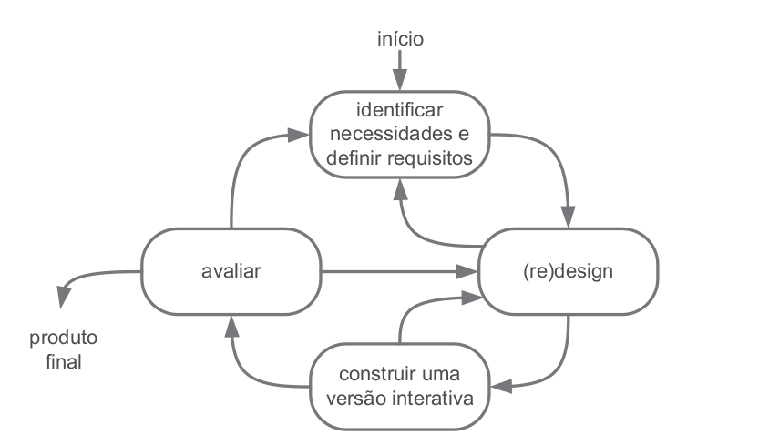

# Processo de Design

## Introdução

Um produto de software, enquanto um artefato de uso humano que possui função, forma, estrutura, qualidade - _e usuários_ - requer a formulação de um processo de _design_, como parte do esforço para minimizar seus problemas e melhorar suas características.

O processo de design pode ser caracterizado como a interação entre três atividades: a *análise* da situação atual, a *síntese* de uma intervenção para a situação atual e a *avaliação* na nova situação obtida a partir da intervenção (Barbosa & Silva, 2010).

Em se tratando de uma _Interação Humano Computador_, é importante que os processos de design apresentem suas atividades organizadas de forma *iterativa*, para que as etapas sejam planejadas e avaliadas sucessivamente, facilitando seu refinamento. 
Além disso, pela essência do produto ser a interação com os usuários e com os demais agentes envolvidos, os _stakeholders_, é comum adotar-se para os processos de design uma abordagem *centrada no usuário*, que segue os seguintes princípios: *foco no usuário*, onde se estuda quem serão os usuários do sistema, seus objetivos, características físicas, cognitivas e comportamentais, formação educacional e o que costumam fazer para alcançar seus objetivos; a definição de *métricas observáveis*, com experimentos e através das quais é possível observar, registrar e analisar as performances e reações dos usuários; e o *design interativo*, que busca permitir que problemas encontrados durante os experimentos e reprojetos sejam corrigidos, através da iteratividade das atividades do processo de design.

Existem várias formas de organizar as atividades descritas acima, e a escolha depende da experiência dos avaliadores, da etapa em que o projeto se encontra, dos objetivos do processo de design e do projeto em si. Estas formas de organizar as atividades do processo de design são organizadas de acordo com o ciclo de vida do projeto. Modelos de ciclo de vida do projeto foram descritos por autores ao longo dos últimos anos, e podemos destacar alguns, como:

## Ciclo de Vida Simples (Preece et al., 2002)

Figura 1: Ciclo de Vida Simples. 

Fonte: Barbosa & Silva, 2010.

 

Neste modelo, representado na Figura 1, as autoras dividem a atividade de síntese em design (ou redesign) conceitual e construção de uma versão (ou versões) interativa. Este modelo é bastante iterativo, com cada atividade permitindo revelar a necessidade de retornar a atividades anteriores para melhorar o artefato produzido, e podendo essas atividades ocorrerem quantas vezes forem necessárias, dentro do que as condições permitirem. É um modelo indicado para designers experientes, visto que é pouco detalhado e bastante "direto ao ponto".

## Ciclo de Vida em Estrela (Hix & Hartson, 1993)

Figura 2: Ciclo de Vida em Estrela. 

Fonte: Barbosa & Silva, 2010.

 

Um dos primeiros ciclos de vida voltados para IHC amplamente difundidos, o Ciclo de Vida em Estrela, representado na Figura 2, tem a característica de permitir que o designer decisa qual atividade deve ser realizada primeiro, a depender do que está disponível quando se inicia o processo e dos objetivos do processo de design. Também é iterativo e não prescreve uma sequência de atividades, e também tem a característica de exigir uma avaliação de cada atividade após sua conclusão, para verificar se está no caminho da solução e decidir os próximos passos.

## Engenharia de Usabilidade de Nielsen

É um conceito definido por Jakob Nielson em 1993, que consiste em um conjunto de atividades que devem ocorrer durante o ciclo de vida do produto. São estas as atividades:
- Conhecer o usuário - e os usos pretendidos do produto
- Realizar uma análise competitiva - examinando produtos com funcionalidades semelhantes ou complementares
- Definir as metas de usabilidade - fatores que devem ser priorizados no projeto
- Fazer designs paralelos - diferentes alternativas de design
- Adotar o design participativo - com conjuntos de usuários "representativos"
- Fazer o design coordenado da interface como um todo - para evitar inconsistências na interface projetada
- Aplicar diretrizes e análise heurística - a adoção de princípios de design e a avaliação do seguimento das diretrizes
- Fazer protótipos - rápidos e de custo baixo, para avaliação junto aos usuários durante o processo
- Relizar testes empíricos - a observação dos usuários ao realizarem os protótipos, dentre outros
- Praticar design iterativo - novas versões a partir dos testes empíricos e correção dos problemas a cada iteração

## Engenharia de Usabilidade de Mayhew

Figura 3: Engenharia de Usabilidade de Mayhew. 

Fonte: Barbosa & Silva, 2010.

 

Neste modelo, representado na Figura 3, Deborah Mayhew (1999) propõe um ciclo de vida para a engenharia de usabilidade, dividido em três fases: análise de requisitos, onde são definidas as metas de usabilidade com base do perfil dos usuários, análise de tarefas, possibilidades e limitações da plataforma do sistema e princípios gerais de design de IHC; design, avaliação e desenvolvimento, onde busca-se conceber uma solução de IHC que atenda às metas de usabilidade da fase anterior; instalação, onde o designer coleta as opiniões do usuário depois de algum tempo de uso, para melhorar o sistema em versões futuras ou identificar a necessidade de desenvolver novos sistemas interativos.

## Ciclo de Vida do Projeto

Para o desenvolvimento do trabalho, utilizaremos o modelo da Engenharia de Usabilidade de Mayhew, por apresentar maior detalhamento das etapas e assim propiciar um melhor aproveitamento e aprendizado dos tópicos abordados na disciplina.

## Referências Bibliográficas

BARBOSA, Simone Diniz Junqueira; DA SILVA, Bruno Santana. Interação humano-computador. Elsevier, 2010.

## Tabela de Versionamento

|    Data    |  Versão  |                   Descrição                   |                         Autor                         |  Revisor  |
| :--------: | :------: | :-------------------------------------------: | :---------------------------------------------------: | :-------: |
| 21/11/2022 |  `1.0`   | Criação da documentação do Processo de Design | [Charles Serafim](https://github.com/charles-serafim) | -
