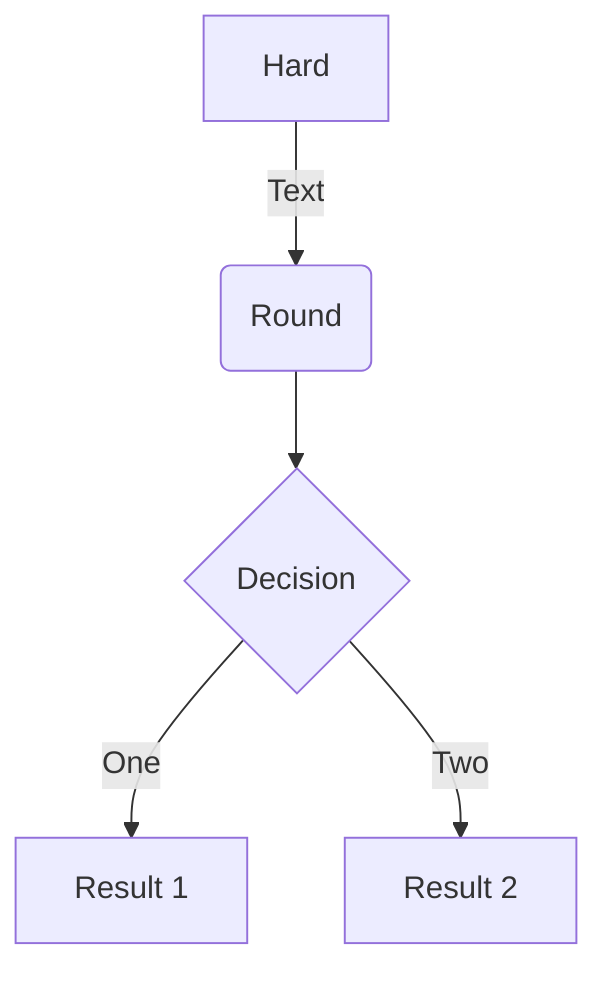

# Análise Hierárquica de Tarefas (HTA) 

## Introdução

Análise de tarefa é um documento destinado a entender qual a rotina do usuário com o sistema, para saber qual suas necessidades e seus objetivos. Utilizada em diversos momentos do desenvolvimento de um software, mas principalmente na análise da situação atual (apoiada ou não por um sistema computacional) no (re)design de um sistema computacional e na avaliação do resultado de uma intervenção que inclua a introdução de um (novo) sistema computacional.

Neste documento faremos uma Análise Hierárquica de Tarefas (sigla em inglês HTA – Hierarchical  Task  Analysis).

## Metodologia

## Referências Bibliográficas

> Barbosa, S. D. J.; Silva, B. S. Interação Humano-Computador. Rio de Janeiro: Elsevier, 2010.

> Preece, J.; Rogers, Y.; Sharp, H. Design de Interação. Porto Alegre: Bookman, 2005.

## Tabela de Versionamento

|    Data    | Versão |   Descrição    |                      Autor                      |                        Revisor                        |
| :--------: | :----: | :------------: | :---------------------------------------------: | :---------------------------------------------------: |
| 12/12/2022 | `1.0`  | Criação do HTA | [Pablo S. Costa](https://github.com/pabloheika) | [Charles Serafim](https://github.com/charles-serafim) |
