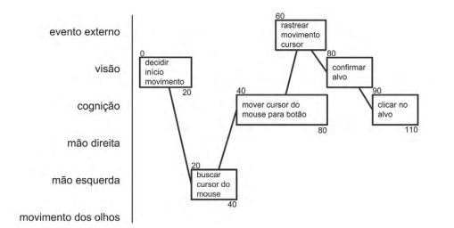

# GOMS

## Introdução

O modelo GOMS (Goals, Operators, Methods, and Selection Rules — Objetivos, Operadores, Métodos e Regras de Seleção) visa analisar o desempenho de usuários competentes de sistemas computacionais, realizando tarefas dentro da sua competência e sem cometer erros. 

O GOMS é um método para descrever uma tarefa e o conhecimento do usuário sobre como realizá-la em termos de:
- **Objetivos:** Representam o que o usuário quer realizar utilizando o software.
- **Operadores:** São primitivas internas (cognitivas) ou externas (as ações concretas que o software permite que os usuário façam, tal como um comando e seus parâmetros digitados no teclado, seleção de menus ou um clique de um botão).
- **Métodos:** São sequências bem conhecidas de sub-objetivos e operadores que permitem atingir um objetivo maior.
Regras de Seleção: Representam tomadas de decisão dos usuários sobre qual método utilizar numa determinada situação.

Os métodos são sequências bem conhecidas de sub-objetivos e operadores que permitem atingir um objetivo maior. Quando há mais do que um método para atingir um mesmo objetivo, são necessárias regras de seleção, que representam tomadas de decisão dos usuários sobre qual método utilizar numa determinada situação.
Dentre os modelos da família GOMS, destacamos: KLM 

## KLM-GOMS

KLM (Keystroke-level model) é uma das técnicas de GOMS e tem o objetivo de prever quanto tempo um usuário levaria para desenvolver uma tarefa em uma rotina sem erros. Essa técnica tem um conjunto predefinido de operadores primitivos, sendo eles:

* Pressionar uma tecla ou botão;
* Apontar com o mouse um alvo num dispositivo visual;
* Mover as mãos para o teclado ou outro dispositivo;
* Desenhar um segmento de reta;
* Se preparar mentalmente para realizar uma ação ou uma série de ações primitivas;
* Tempo de resposta do sistema.

 
 

Tabela 1 - Operador Primitivo (Kieras, 1993) 

| Operador | Operação | Duração Média |
| :------: | :------: | :-----------: |
| K | Pressionar e soltar uma tecla do teclado | Depende do sistema |
| P | Pressionar e soltar uma tecla do teclado | 1,10s |
| B | Pressionar e soltar uma tecla do teclado | 0,20s |
| H | Pressionar e soltar uma tecla do teclado | 0,40s |
| T(n) | Pressionar e soltar uma tecla do teclado | n * K s |
| M | Pressionar e soltar uma tecla do teclado | 1,2s |
| W(t) | Pressionar e soltar uma tecla do teclado | Depende do sistema |

Fonte: Autoria própria. 

Na tabela 1, No operador K, sua duração média está como "depende", pois cada pessoa tem seu tempo para digitar em um computador, mesmo sabendo passo a passo do que vai ser feito, assim na tabela 2 está apresentado a duração média de cada tipo de digitador e posteriormente é escolhido o digitador mediano para fazer as análises.

 
 

Tabela 2 - Tipos de digitadores do operador primitivo K apresentado na tabela 1

| Digitador | Duração Média |
| :------: | :------: |
| Exímio digitador (135 ppm) | 0,08s |
| Bom digitador (90 ppm) | 0,12s |
| Digitador mediano (55 ppm) | 0,20s |
| Digitador inexperiente (40 ppm) | 0,28s |
| Digitação de letras aleatórias | 0,50s |
| Digitação de códigos complexos | 0,75s |
| Digitalizador não familiarizados com o teclado | 1,20s |

Fonte: Autoria própria. 

#### Resultado da análise de desempenho do web site Prefeitura de Sorocaba com o KLM

 
 

Tabela 3 - Tabela exemplo de Análise de tarefa 

|  Operação | Tempo Médio |
| ------------ | ------------ |
| Operador - Operação | Tempo |
| <b>Tempo total</b> | <b> Tempo total</b>

Fonte: Autoria própria. 

##### Análise de tarefa: Acessar a aba “Notícias”

 
 

Tabela 4 - Análise de tarefa: Acessar a aba “Notícias” 

|  Operação | Tempo Médio |
| ------------ | ------------ |
| M - Preparação | 1,20s |
| H - Levar a mão ao mouse | 0,30s |
| P - Levar o cursor a aba "Notícias" | 1s |
| B - Pressionar o botão do mouse | 0,20s |
| B - Soltar o botão do mouse | 0,20s |
| P - Levar o cursor até uma notícia | 0,20s |
| B - Pressionar o botão do mouse | 0,20s |
| B - Soltar o botão do mouse | 0,20s |
| <b>Tempo total</b> | <b>4,30s</b>

</enter>

Fonte: Autoria própria. 

##### Análise de tarefa: Acessar a aba “Concursos e Processos Seletivos”

 
 

Tabela 5 - Análise de tarefa: Acessar a aba “Concursos e Processos Seletivos” 

|  Operação | Tempo Médio |
| ------------ | ------------ |
| M - Preparação | 1,20s |
| H - Levar a mão ao mouse | 0,30s |
| P - Levar o cursor a aba “Concursos e Processos Seletivos” | 1s |
| B - Pressionar o botão do mouse | 0,20s |
| B - Soltar o botão do mouse | 0,20s |
| P - Levar o cursor até um concurso | 1s |
| B - Pressionar o botão do mouse | 0,20s |
| B - Soltar o botão do mouse | 0,20s |
| P - Levar o cursor até um edital | 1s |
| B - Pressionar o botão do mouse | 0,20s |
| B - Soltar o botão do mouse | 0,20s |
| <b>Tempo total</b> | <b>5,7s</b>

Fonte: Autoria própria. 

##### Análise de tarefa: Consultar 2° via de IPTU

KLM (Keystroke-level model) é uma das técnicas de GOMS e tem o objetivo de prever quanto tempo um usuário levaria para desenvolver uma tarefa em uma rotina sem erros. Essa técnica tem um conjunto predefinido de operadores primitivos, sendo eles:

 
 

Tabela 6 - Análise de tarefa: Consultar 2° via de IPTU 

|  Operação | Tempo Médio |
| ------------ | ------------ |
| M - Preparação | 1,20s |
| H - Levar a mão ao mouse | 0,30s |
| P - Levar o cursor a aba “IPTU” | 1s |
| B - Pressionar o botão do mouse | 0,20s |
| B - Soltar o botão do mouse | 0,20s |
| P - Levar o cursor até “Segunda via – IPTU e Taxas Diversas” | 1s |
| B - Pressionar o botão do mouse | 0,20s |
| B - Soltar o botão do mouse | 0,20s |
| P - Levar o cursor até “Inscrição Imobiliária" | 1s |
| B - Pressionar o botão do mouse | 0,20s |
| B - Soltar o botão do mouse | 0,20s |
| T(15) - Digitar o número de “Inscrição Imobiliária" | 7,5 |
| B - Pressionar o botão do mouse | 0,20s |
| B - Soltar o botão do mouse | 0,20s |
| P - Levar o cursor até “F9-Pesquisar” | 1s |
| B - Pressionar o botão do mouse | 0,20s |
| B - Soltar o botão do mouse | 0,20s |
| W(T) -Espera pela resposta do sistema | 0,2s | 
| <b>Tempo total</b> | <b>15s</b>

Fonte: Autoria própria. 

## CPM-GOMS

O CPM-GOMS foi assim designado por dois motivos: por representar operadores cognitivos, perceptivos e motores, e por seguir a abordagem de Critical Path Method (técnica de análise do caminho crítico).  CPM-GOMS é uma versão do GOMS baseada diretamente no processador humano de informações e, portanto, no modelo de estágios paralelos de processamento do processamento humano de informações. Isso significa que o CPM-GOMS não supõe que os operadores são executados sequencialmente. Em outras palavras, operadores cognitivos, perceptivos e motores podem ser tornar paralelos conforme a tarefa. O CPM-GOMS utiliza um diagrama tipo PERT para representar os operadores e as dependências entre eles. Nessa análise, o caminho crítico fornece uma previsão simples do tempo total da tarefa (Figura 1).

Figura 1 - Exemplo de modelo CPM-GOMS 

Fonte: Capítulo 06 - Organização do Espaço de Problema – Livro IHC: Barbosa e SilvaArquivo. (Figura 6.3) 

## Bibliografia
> Barbosa, S. D. J.; Silva, B. S. da; Silveira, M. S.; Gasparini, I.; Darin, T.; Barbosa, G. D. J. (2021);Interação Humano-Computador e Experiência do usuário.

> Card, Stuart K., Newell, Allen, e Moran, Thomas P. (1983). The Psychology of Human-Computer
Interaction. L. Erlbaum Associates Inc., USA.

> John, Bonnie E. (2003). Information processing and skilled behavior. In HCI models, theories, and
frameworks: Toward a multidisciplinary science, pages 55–101. Morgan Kaufman

## Tabela de Versionamento

| Data | Versão | Descrição | Autor | Revisor |
| ---- | ------ | --------- | ----- | ------- |
| 03/12/2022 | `1.0`  | Criação da página e adição das análises| [Lucas Gomes](https://github.com/Neitan2001) | [Maria Abritta](https://github.com/MariaAbritta)