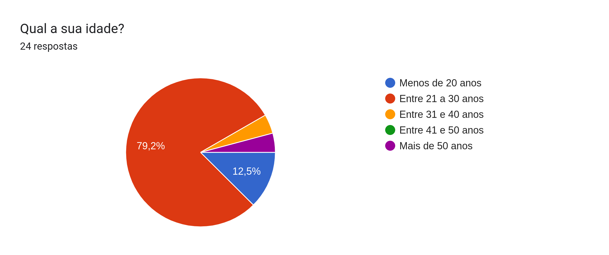
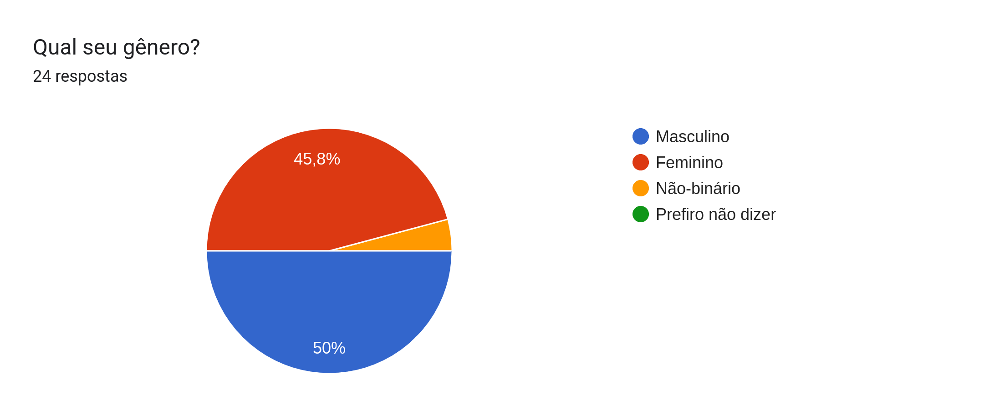
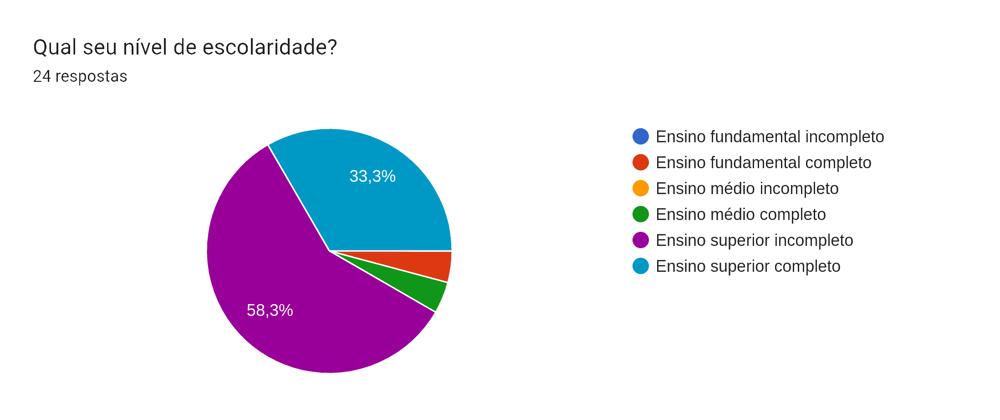
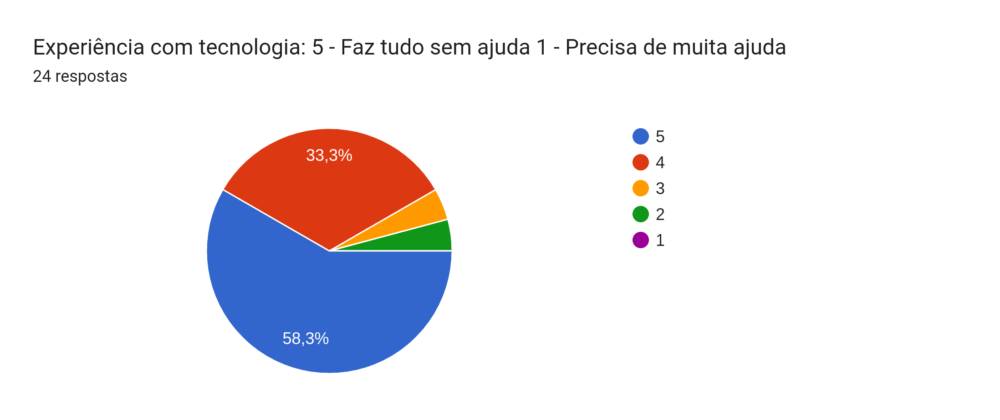
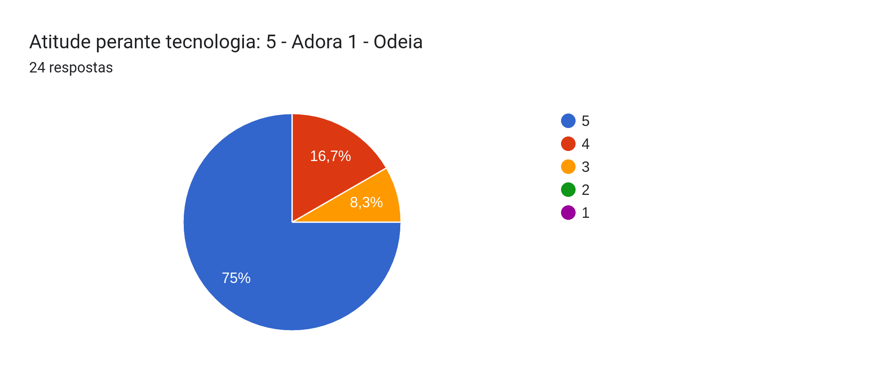

# Perfil de Usuario

## Introdução

Esse documento visa explorar as caracteristicas de usuários do sistema do site da Prefeitura de Sorocaba e traçar os seus perfis por meio de um questionário aplicado a pessoas reais com o objetivo de coletar suas informações.

O Perfil de usuário se dá por meio do entendimento das informações reais de usuários e a criação de grupos com base nas informações semelhantes encontradas durante a pesquisa. Serão criados diversos Perfis de acordo com os grupos identificados pelo grupo

## Metodologia

...

## Dados

...

### Cronograma Geral

Figura 1: Gráfico apresentando a idade dos entrevistados. 

Fonte: Autoria própria. 

Figura 2: Gráfico apresentando o genero dos entrevistados. 

Fonte: Autoria própria. 

Figura 3: Gráfico apresentando o nível de escolaridade dos entrevistados. 

Fonte: Autoria própria. 

Figura 4: Gráfico apresentando a ocupação dos entrevistados. 

Fonte: Autoria própria. 

Figura 5: Gráfico apresentando o grau de uso de tecnologia dos entrevistados. 

Fonte: Autoria própria. 

Figura 6: Gráfico apresentando a experiência com tecnologia dos entrevistados. 

Fonte: Autoria própria. 

Figura 6: Gráfico apresentando a atitude comm tecnologia dos entrevistados. 

Fonte: Autoria própria. 

...

## Referências Bibliográficas

...

## Tabela de Versionamento

|    Data    | Versão |       Descrição       |                      Autor                      |              Revisor              |
| :--------: | :----: | :-------------------: | :---------------------------------------------: | :-------------------------------: |
| 30/11/2022 | `1.0`  | Criação do documento  | [Pablo S. Costa](https://github.com/pabloheika) | [Luan](https://github.com/Luanmq) |
| 01/12/2022 | `1.1`  | Criação da Introdução |        [Luan](https://github.com/Luanmq)        | [Luan](https://github.com/Luanmq) |
