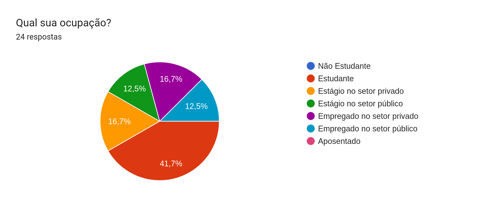
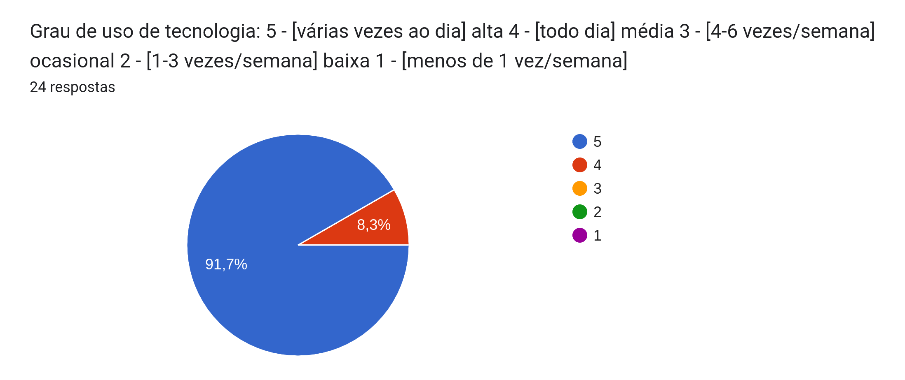

# Perfil de Usuario

## Introdução

Esse documento visa explorar as características de usuários do sistema do site da Prefeitura de Sorocaba e traçar os seus perfis por meio de um questionário aplicado a pessoas reais com o objetivo de coletar suas informações.

O Perfil de usuário se dá por meio do entendimento das informações reais de usuários e a criação de grupos com base nas informações semelhantes encontradas durante a pesquisa. Serão criados diversos Perfis de acordo com os grupos identificados pelo grupo

## Metodologia

Para a coleta de dados o grupo optou pela aplicação de um formulário online e o seu envio para os usuários do sistema. Segue abaixo o resultado da coleta de dados pela pesquisa:

### Dados demográficos

 

Figura 1: Gráfico apresentando a idade dos entrevistados. 

Fonte: Autoria própria. 

 

Figura 2: Gráfico apresentando o genero dos entrevistados. 

Fonte: Autoria própria. 

 

Figura 3: Gráfico apresentando o nível de escolaridade dos entrevistados. 

Fonte: Autoria própria. 

 

Figura 4: Gráfico apresentando a ocupação dos entrevistados. 

Fonte: Autoria própria. 

### Relação com a tecnologia

 

Figura 5: Gráfico apresentando o grau de uso de tecnologia dos entrevistados. 

Fonte: Autoria própria. 

 

Figura 6: Gráfico apresentando a experiência com tecnologia dos entrevistados. 

Fonte: Autoria própria. 

 

Figura 7: Gráfico apresentando a atitude perante tecnologia dos entrevistados. 

Fonte: Autoria própria. 

### Avaliação do site

 

Tabela 1: Respostas dos entrevistados a pergunta: Que funcionalidades você espera encontrar em um site da sua prefeitura? Que funcionalidades você gostaria de encontrar? 

|                  Que funcionalidades você espera encontrar em um site da sua prefeitura? Que funcionalidades você gostaria de encontrar?                   |
| :--------------------------------------------------------------------------------------------------------------------------------------------------------: |
|                                   Notícias da cidade, informações sobre as localizações de locais importantes na cidade.                                   |
|                                                    Opções sobre serviços comunitários de fácil acesso.                                                     |
|                                                                 Gastos e futuros projetos                                                                  |
|                  Espero uma funcionalidade que torne o site acessível a todo e qualquer tipo de pessoa, sendo ela com deficiência ou não.                  |
|  Gostaria de encontrar um site dinâmico onde eu consiga saber todos os eventos que vão ter dentro da cidade e notícias completas das que já aconteceram.   |
|        Tenho deficiência visual (daltonismo) e espero acessibilidade para uma escala de cinza (para evitar algumas confusões mentais com as cores)         |
|                                                 Gostaria de encontrar um site mais simples e fácil de usar                                                 |
|                           Espero encontrar um junção com a parte organizacional da prefeitura, para poder fazer tudo pelo site.                            |
|                  Desejo encontrar um site simples de se usar, então gostaria de funcionalidades intuitivas e um design fácil de entender                   |
|                                                     Agendamento para realização de documentos pessoais                                                     |
|                                                                    Serviços e notícias.                                                                    |
|                                                                    Internet mais rápida                                                                    |
|                                     Que seja um site didático, fácil de mexer e encontrar as informações que procura.                                      |
|                                              Notícias, informações sobre transporte público, saúde, eventos.                                               |
|                                          Interface agradável, soluções para problemas gerais, pagamento IPTU etc.                                          |
|                               portal da transparência, ultimas noticias sobre a cidade, informações sobre futuros concursos                                |
| Informações sobre horário de funcionamento de locais municipais, história da cidade, notícias de campanhas municipais, informações sobre pontos turísticos |
|                                           Perguntas sobre o desenvolvimento da cidade, segurança, dentre outros                                            |
|                                                  Gostaria de realizar um acesso simplificado à informação                                                  |
|                    Portal de transparência, Portal de solicitação de serviços na cidade, portal de registrar irregularidades na cidade                     |
|                                                  Informaçãoes sobre o posto de saúde da minha localidade                                                   |
|                                                         Prestação de contas, linhas de transporte                                                          |
|                                                                            Nada                                                                            |
|       Abas em que o usuário seja direcionado para os diversos serviços geridos pela prefeitura, informativos com dados do portal da transparênci a.        |

Fonte: Autoria própria. 

 

Tabela 2: Respostas dos entrevistados a pergunta: Encontrou as funcionalidades que esperava no site da Prefeitura de Sorocaba? Se não encontrou, quais foram elas? 

|                                              Encontrou as funcionalidades que esperava no site da Prefeitura de Sorocaba?                                              |               Se não encontrou, quais foram elas?                |
| :--------------------------------------------------------------------------------------------------------------------------------------------------------------------: | :--------------------------------------------------------------: |
|                                                                                  Não                                                                                   |                                                                  |
|                                                   Só encontrei as notícias, faltou a parte dos locais importantes da                                                   |                             cidade.                              |
|                                                                             Sim, encontrei                                                                             |                                                                  |
|                                                           Não encontrei nada que tornasse o site acessível.                                                            |                                                                  |
|                                                  Não encontro sobre os eventos que irão acontecer mas encontrei a aba                                                  |        notícias, porém demora muito a carregar essa aba!         |
|                                                                  Não encontrei nenhuma acessibilidade                                                                  |                                                                  |
|                                                  Não, o site tem trocentas abas e muitas coisas espalhadas que da até                                                  |                         confusão visual                          |
|                                                   Encontrei, porém são apenas caminhos e mais caminhos para chegar a                                                   | uma questão específica, sendo praticamente um “caminho de rato”. |
|                                                           Não, o site possui diversas coisas ao mesmo tempo                                                            |                                                                  |
|                                                        Não. Agendamento para realização de documentos pessoais                                                         |                                                                  |
|                                                                                  Sim                                                                                   |                                                                  |
|                                                                          Internet mais rápida                                                                          |                                                                  |
|                                                                             Não encontrei.                                                                             |                                                                  |
|                                                                               Não todas.                                                                               |                                                                  |
|                                                                             Em média sim.                                                                              |                                                                  |
|                                               nao encontrei informações referentes a transparência nem futuros concursos                                               |                                                                  |
|                                                               Não vi horários de funcionamento de locais                                                               |                                                                  |
|                                                                             Em parte sim.                                                                              |                                                                  |
|                                                                               Encontrei                                                                                |                                                                  |
|                Não identifiquei de forma clara se no site possui a opção de registrar solicitação de serviços na sociedade e registrar irregularidades                 |                                                                  |
|                                                                                  Sim                                                                                   |                                                                  |
| O site não funciona. Ao clicar nas abas não somos direcionados para nenhum lugar, o site é pouco acessível (acessibilidade geral), em razão da sobreposição de imagens |                                                                  |

Fonte: Autoria própria. 

 

Figura 8: Gráfico apresentando a opinião sobre o sistema atual dos entrevistados. 

Fonte: Autoria própria. 

## Definição dos Perfis

Após a coleta dos dados foi feita uma análise dos mesmos e a separação deles em Perfis, agrupando dados com características semelhantes. Segue abaixo os perfis definidos com suas respectivas características:

### Perfil 1

- **1. Idade:** Entre 21 e 30 anos
- **2. Experiência:** Superior Completo
- **3. Atitudes:** Calmo e inteligente
- **4. Tarefas primárias:** Acesso do site buscando acessibilidade

### Perfil 2

- **1. Idade:** Entre 21 e 30 anos
- **2. Experiência:** Superior Completo
- **3. Atitudes:** Rígido e determinado
- **4. Tarefas primárias:** Acesso das notícias

### Perfil 3

- **1. Idade:** Menos de 20 anos
- **2. Experiência:** Superior Inompleto
- **3. Atitudes:** Agitado e curioso
- **4. Tarefas primárias:** Acesso do site buscando um ambiente dinâmico e fácil de utilizar

## Referências Bibliográficas

>  Barbosa, S. D. J.; Silva, B. S. da; Silveira, M. S.; Gasparini, I.; Darin, T.; Barbosa, G. D. J. (2021);Interação Humano-Computador e Experiência do usuário.

> 2020.1-BCE - Wiki. Disponível em: <<https://interacao-humano-computador.github.io/2020.1-BCE/#/>>. Acesso em: 01 de dezembro de 2022.

## Tabela de Versionamento

|    Data    | Versão |            Descrição             |                      Autor                      |                     Revisor                     |
| :--------: | :----: | :------------------------------: | :---------------------------------------------: | :---------------------------------------------: |
| 30/11/2022 | `1.0`  |       Criação do documento, adiciona graficos tratados.     | [Pablo S. Costa](https://github.com/pabloheika) |        [Luan](https://github.com/Luanmq)        |
| 01/12/2022 | `1.1`  |      Criação da Introdução       |        [Luan](https://github.com/Luanmq)        | [Pablo S. Costa](https://github.com/pabloheika) |
| 01/12/2022 | `1.2`  |        Adição de imagens         | [Lucas Gomes](https://github.com/lucasgacaldas) | [Pablo S. Costa](https://github.com/pabloheika) |
| 01/12/2022 | `1.3`  | Criação dos perfis e Referências |        [Luan](https://github.com/Luanmq)        | [Pablo S. Costa](https://github.com/pabloheika) |
| 01/12/2022 | `1.2`  | Adiciona dados das entrevistas em tabelas e graficos |       [Pablo S. Costa](https://github.com/pabloheika)       |   [Luan](https://github.com/Luanmq) |
