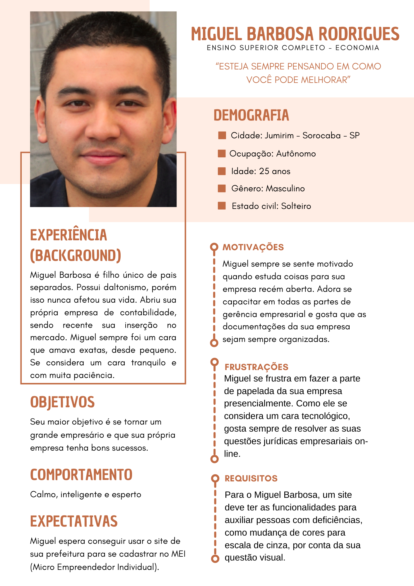
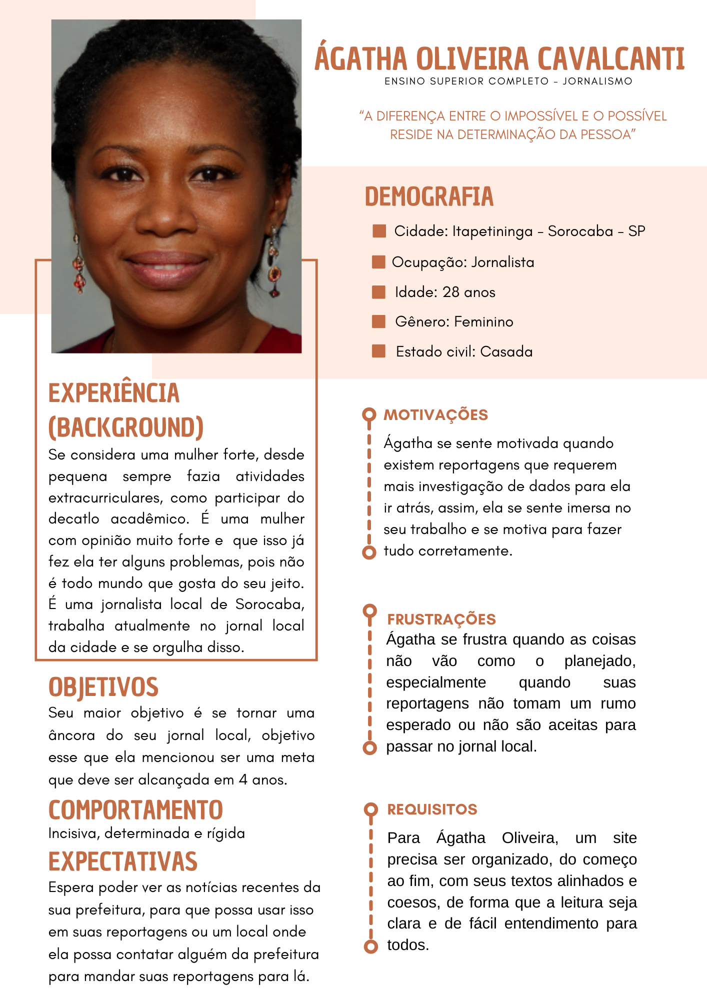
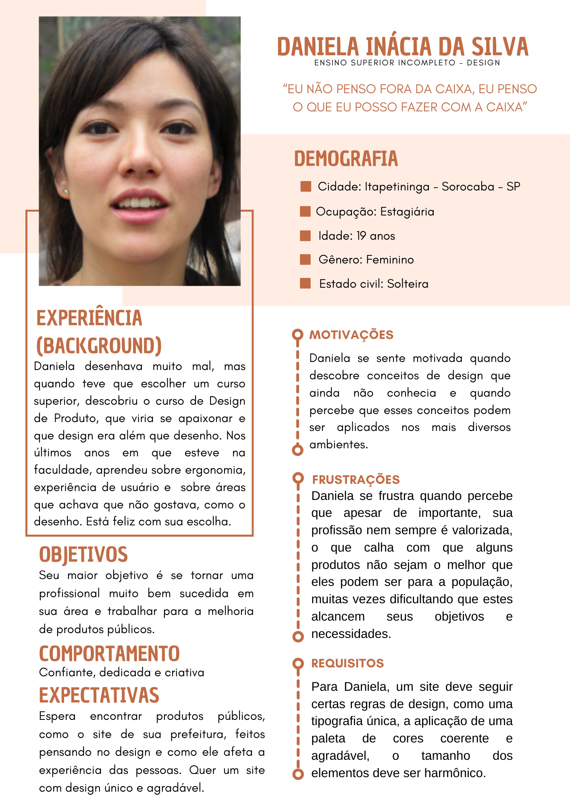
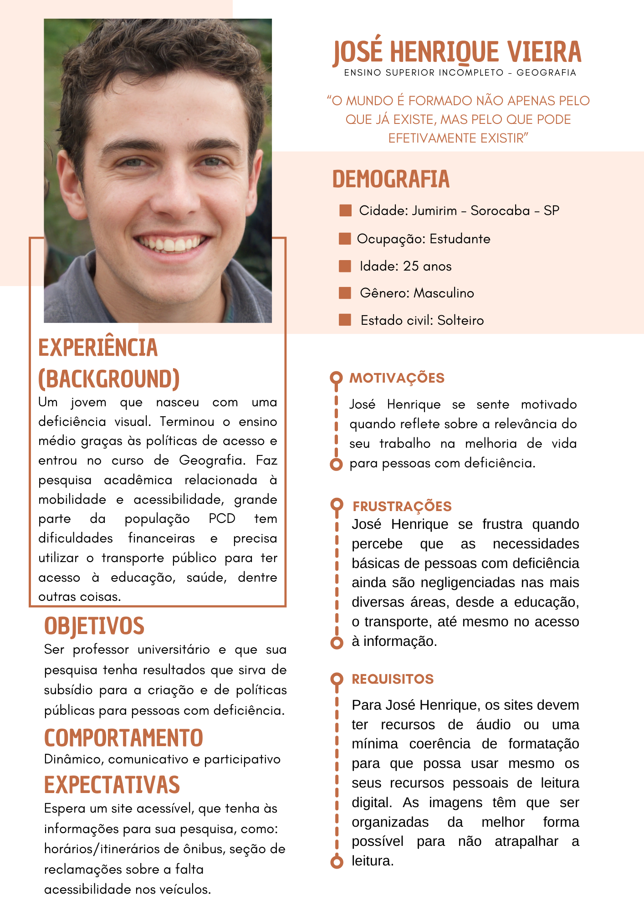
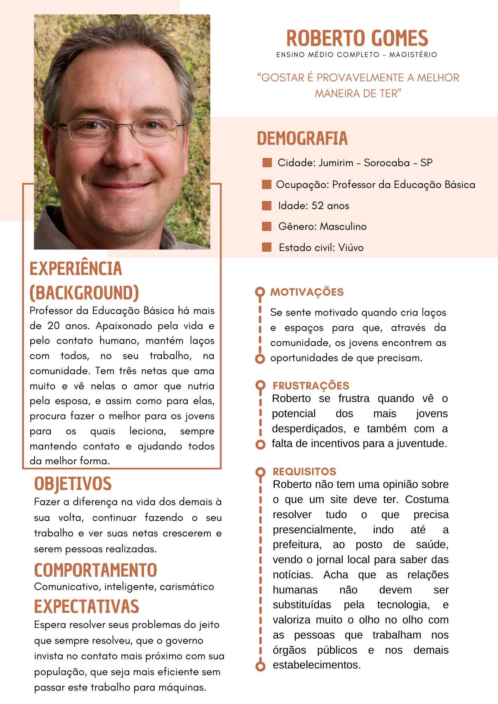

# Personas

## Introdução
A técnica do uso de personas é utilizada para representar um grupo de usuários finais de um sistema. Esta técnica é muito utilizada durante discussões de design e elicitação de requisitos, para que o time se mantenha focado em um mesmo alvo em relação aos usuários. Dessa forma, fazendo com que a equipe não busque satisfazer a maior parte das pessoas, e sim seus grupos de usuários reais.

  Uma persona é um personagem fictício com características baseadas em grupos de usuários reais. As personas tem como objetivo descrever um usuário típico do sistema. Estes personagens, embora sejam fictícios, são derivados de processos de investigação e pesquisa que buscam levantar dados e características sobre os usuários, no caso deste projeto tais investigações e seus resultados podem ser encontrados na secção de [Perfil de usuário](/pages/projeto/etapa2/perfil_usuario.md). Aliado a isso, as personas são dividas em:
* Primárias: foco principal do sistema, representa o usuário que interage regularmente com o sistema.
* Secundárias: usuários que interagem ocasionalmente com o sistema.

Além disso, uma adição para esta técnica é a criação de antipersonas que, diferente das personas, buscam descrever e especificar grupos de usuários que o time não deve focar durante o desenvolvimento do sistema.

## Metodologia
  Para podermos especificar nossos grupos de usuários em forma de persona, primeiro tivemos que definir quantas personas seriam criadas. E após conversas entre o grupo baseadas nas aulas ministradas e nas referências bibliográficas utilizadas, foi decidido que seriam estabelecidas 4 personas primárias e 1 antipersona.

  Diante disso, a criação de nossas personas foram baseadas em alguns dos elementos característicos especificados por Courage e Baxter(2005), que são:

* Identidade: nome, sobrenome, idade e outros dados demográficos.
* Status: define se é persona primária, secundária, ou então, outro stakeholder ou antipersona.
* Objetivos: descreve objetivos das personas.
* Habilidades: especialidade, grau de escolaridade.
* Comportamento: como que a persona se relaciona.
* Requisitos: de que a persona precisa.
* Expectativas: como a persona acredita que o sistema funciona.

## Personas
 

Persona Primária

Fonte: Autoria própria. Imagem: [This Person Does Not Exist](https://thispersondoesnotexist.com/) 

 

Persona Secundária

Fonte: Autoria própria. Imagem: [This Person Does Not Exist](https://thispersondoesnotexist.com/) 

 

 

Persona Secundária

Fonte: Autoria própria. Imagem: [This Person Does Not Exist](https://thispersondoesnotexist.com/) 

 

Persona Secundária

Fonte: Autoria própria. Imagem: [This Person Does Not Exist](https://thispersondoesnotexist.com/) 

 

Antipersona

Fonte: Autoria própria. Imagem: [This Person Does Not Exist](https://thispersondoesnotexist.com/) 

## Tabela de Versionamento

| Data | Versão | Descrição | Autor | Revisor |
| ---- | ------ | --------- | ----- | ------- |
| 03/12/2022 | `1.0`  | Criação da página e adição das análises| [Maria Abritta](https://github.com/MariaAbritta) | [Charles](https://github.com/charles-serafim)
| 05/12/2022 | `1.1`  | Revisão e reajustes| [Charles](https://github.com/charles-serafim) | [Maria Abritta](https://github.com/MariaAbritta)