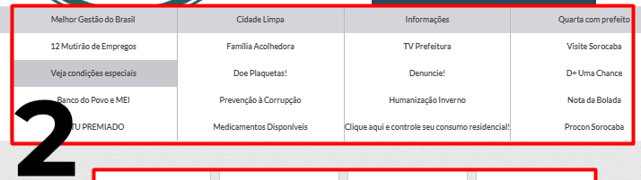
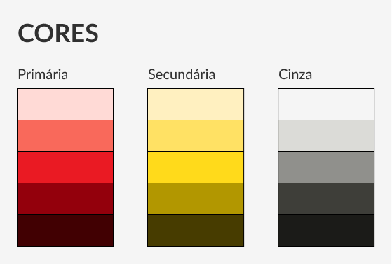

# Guia de estilo

## Introdução

## Análise do ambiente de trabalho

Antes da realização do Guia de estilo em si é importante entender o contexto de trabalho do usuário para saber quais elementos devem ser trabalhados, assim foi feita uma análise dos principais recursos que o usuário tem acesso dentro do site, chegando em 3 componentes para serem analisados. Segue abaixo uma imagem da tela inicial do site com marcações indicando os 3 elementos que serão analisados:

Figura 1: Página inicial do site com marcações indicando 3 elementos da tela. 

Fonte: Autoria própria, 2022. 

### 1. Menu superior de navegação

Figura 1: Menu superior de navegação. 

Fonte: Autoria própria, 2022. 

O primeiro elemento que se trata de um menu de navegação bastante comum em outros sites. Dentro do site da prefeitura de Sorcaba, esse menu é responsável por levar o usuário a conhecer mais sobre o Governo Municipal, as diretrizes do município, a carta de serviços da prefeitura, a legislação do município e as notícias da região, além das funcionalidades de Busca e retorno a tela inicial.

### 2. Menu de navegação do carrossel

Figura 1: Menu de navegação do carrossel. 

Fonte: Autoria própria, 2022. 

Mais abaixo no site é possível notar uma tabela com uma série de opções, ao navegar nessas opções é possível perceber que se trata de um menu para selecionar qual das opções irá aparecer no carrossel acima do menu.

Esse menu não é uma funcionalidade comum em outros sites e causa confusão no primeiro contato. O carrossel vai passando entre as opções automaticamente numa ordem não muito óbvia, gerando uma quebra de expectativa do usuário, além de um desfoque por conta da mudança constante.

Outro ponto negativo é a falta de constraste entre as cores trazendo dificuldade para entender a delimitação entre a tabela e o carrossel e mostrar quando a primeira linha da tabela (mais escura) está selecionada para aparecer no carrossel.

### 3. Menu de funcionalidades

Figura 1: Menu de funcionalidades. 

Fonte: Autoria própria, 2022. 

Já na parte inferior do recorte da tela inicial do site da prefeitura, é possível notar um terceiro menu indicando o acesso à algumas funcionalidades. Esse menu ajuda ao usuário acessar as funcionalidades que busca de forma mais direta e rápida, também facilitando o contato para usuários que não tem tanta experiência com tecnologia.

Porém as funcionalidades estão apenas alocadas nesse espaço sem nenhum contexto ou enunciação prévia, incluindo algumas com nomes não significativos. Dessa forma, o usuário pode ficar confuso durante o seu uso caso a funcionalidade que busca não esteja com o nome listado dentre as mostradas.

## Elementos de interface

Uma das partes importantes do Guia de estilo são os elementos de interface. Esses elementos são responsáveis por compor as interfaces gráficas que os usuários terão contato durante o uso do sistema. Segue abaixo cada um dos elementos trabalhados nesse tópico:

### Janelas

Foram consideradas pelo grupo as janelas sendo todo o espaço que contempla a interface de uma das páginas do site. Para garantir a padronização dos diferentes ambientes do site foi pensado em um modelo simples e escalável para orientar os designers no momento de pensar uma interface para o sistema. O modelo feito pelo grupo contém 3 elementos ilustrados abaixo:

Figura 1: Modelo de janelas utilizadas no sistema. 

Fonte: Autoria própria, 2022. 

### Tipografia

A Tipografia é a área no design gráfico que trabalha o desenho de letras para uso em textos e demais contextos. A tipografia é um elemento importante de ser definido para que transmita a mensagem pensada para o sistema.

A tipografia escolhida foi a fonte Latos. A escolha da fonte foi pensada por já ser utilizada no sistema atualmente e por ter uma boa leitura, além de ser uma fonte sem serifa trazendo mais modernidade para o site. Segue abaixo uma ilustração mostrando os diferentes pesos, contextos e suas aplicações da fonte escolhida:

Figura 1: Tipografias utilizadas no sistema. 

Fonte: Autoria própria, 2022. 

### Cores

As cores são um elemento essencial no guia de estilo e são responsáveis por grande parte da mensagem comunicada pela interface ao usuário. Para a escolha das cores foi pensada em uma paleta minimalista focando em apenas 3 cores, com suas respectivas variações para garantir a adaptação em diferentes contextos do sistema. Segue abaixo a ilustração mostrando cada uma das cores definidas:

Figura 1: Cores utilizadas no sistema. 

Fonte: Autoria própria, 2022. 

#### Primária

A cor primária escolhida foi o vermelho, já identificado em alguns elementos na interface do site atual. É uma cor forte que deve ser utilizada em elementos de destaque da interface. Foram escolhidas diversas tonalidades a partir da cor para garantir a versatilidade da sua aplicação em diferentes contextos do sistema.

#### Secundária

O amarelo ficou como cor secundária escolhida, uma cor também voltada para o destaque, mas em uma hierarquia abaixo do vermelho. O amarelo pode acompanhar o vermelho em diferentes contextos da interface. Para a cor secundária também foram escolhidas diversas tonalidades para garantir a versatilidade da sua aplicação em diferentes contextos.

#### Cinza

Por último foi escolhida a cor cinza. Uma cor neutra característica de ambientes digitais voltada para aplicação no fundo de telas e em demais contextos onde é necessário um baixo contraste.

## Elementos de interação

## Elementos de ação

Os elementos de ação são os componentes nos quais o usuário desempenha alguma ação, seja selecionando ou inserindo algum dado. Segue abaixo os principais elementos separados pelo grupo e os seus modelos fixos que devem ser adotados para reprodução no design das interfaces, de acordo com o contexto da ação a ser desempenhada.

### Botão

Figura 1: Modelos de botões. 

Fonte: Autoria própria, 2022. 

### Input

Figura 1: Modelos de inputs. 

Fonte: Autoria própria, 2022. 

### Checkbox

Figura 1: Modelos de checkbox. 

Fonte: Autoria própria, 2022. 

## Vocabulários e padrões

## Referências Bibliográficas

ABNT | Referências Bibliográficas. [S. l.], [entre 2015 e 2022]. Disponível em: <https://referenciabibliografica.net/a/pt-br/ref/abnt>. Acesso em: 25 nov. 2022.

Dicas para seu TCC: veja como fazer referência ABNT. [S. l], 2020. Disponível em: <https://ead.urcamp.edu.br/blog/dicas-tcc-referencia-abnt>. Acesso em: 25 nov. 2022.

BARBOSA, Simone Diniz Junqueira; DA SILVA, Bruno Santana. Interação humano-computador. Elsevier, 2010.

## Tabela de Versionamento

|    Data    | Versão |      Descrição       |               Autor               |                    Revisor                     |
| :--------: | :----: | :------------------: | :-------------------------------: | :--------------------------------------------: |
| 21/11/2022 | `1.0`  | Criação do documento | [Luan](https://github.com/Luanmq) | [Lucas Gomes](https://github.com/lucasgcaldas) |
