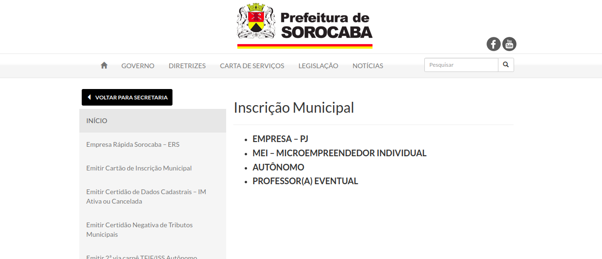
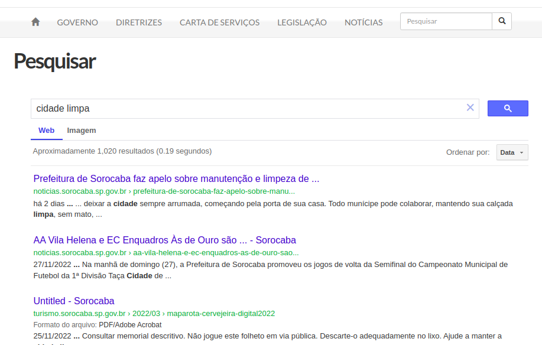

# Principios Gerais e Diretrizes do Projeto

## 1. Introdução
Como abordado por Simone Barbosa (2010), princípios costumam representar objetivos gerais e de alto nível, já diretrizes são regras gerais que podem ser observadas na prática.

Diante disso, princípios e diretrizes podem ser utilizados para auxiliar o design, motivando o designer a seguir padrões de aparência e comportamento. Porém, é importante destacar que o uso destes artefatos não substitui as demais atividades de análise, design e avaliação. Dessa forma, estas diretrizes e princípios dependem do conhecimento do designer sobre o problema que está enfrentando, para que desta forma saiba quais são adequadas à cada situação.

 

## 2. Princípios
Para a determinação dos princípios e diretrizes gerais deste projeto, faremos uso do modelo criado por Norman (1998) e referenciado por Simone Barbosa (2010). Desta forma, como definido por ele, é necessário o uso de um modelo conceitual para a projeção do sistema, para que assim o usuário possa aprender a usá-lo rapidamente e sem dificuldades. Norman (1988) também enfatiza que o design deve:
* Utilizar restrições para determinar quais ações são possíveis a cada momento.
* Tornar as coisas visíveis.
* Avaliar o estado corrente do sistema
* Seguir mapeamentos naturais entre:
    * As intenções do usuário e as ações requeridas do sistema.
    * As ações e o efeito resultante.
    * A informação visível e a interpretação do estado do sistema.

 A partir disto, os princípios e diretrizes que serão utilizados para o projeto são:

### 2.1 Correspondência com as Expectativas dos Usuários
Como ressaltado anteriormente, é importante que exploremos mapeamentos naturais entre as variáveis físicas e mentais, nos certificando que o usuário consegue determinar os relacionamentos entre suas ações e as reações do sistema.

Além disso, segundo Nielsen (1993), é necessário seguir convenções do mundo real, trazendo informações em uma ordem natural e lógica, assim facilitando a interação do usuário com o sistema. E também, Nielsen (1993) destaca a importância de fornecer feedbacks informativos ao usuário na conclusão de um grupo de ações, para gerar um sentimento de satisfação no usuário ao finalizar uma tarefa

### 2.2 Simplicidade nas Estruturas das Tarefa
Norman (1988) defende que é necessário simplificar a estrutura das tarefas, e para isso é necessário diminuir a quantidade de planejamento e resolução de problemas que elas requerem.

Com o objetivo de simplificar as estruturas das tarefas, os designers podem:
* Fornecer diversas formas de apoio para que os usuários possam aprender e realizar a tarefa
* Tornar visível o que seria invisível, melhorando o feedback e o controle do usuário sobre a tarefa.
* Automatizar toda ou parte da tarefa
* Modificar a natureza da tarefa

### 2.3 Equilíbrio entre Controle e Liberdade do Usuário
Tognazzini (2003) ressalta a importância de deixar o usuário no comando da interface, afirmando que o computador, a interface e o ambiente de trabalho pertencem ao usuário. Dessa forma, quando deixamos o usuário no comando do sistema, ele aprende rapidamente a utilizá-lo. Porém, também é ressaltado que existe um limite de liberdade a ser dada ao usuário no sistema, pois quando não há limites ou restrições eles podem se sentir perdidos ou angustiados com o excesso de opções. Com isso, devemos reduzir o número de decisões que o usuário deve tomar a cada instante.

Segundo Cooper (1999), o software deve ser maleável, não forçando os usuários a trabalharem de um único modo, porém guardando um registro dos responsáveis por cada ação. Além disso, Nielsen (1993) e Tognazzi (2003) ressaltam a importância de permitir que o usuário cancele, desfaça e refaça suas ações, assim reduzindo a ansiedade e o medo de errar. E quando uma operação for considerada perigosa e não puder ser desfeita, deve-se projetar medidas de segurança para que não seja realizada acidentalmente.

### 2.4 Consistência e Padronização
Norman (1988) defende a necessidade de assegurar a consistência da interface com o modelo conceitual embutido no sistema, para isso, é necessário garantir que tudo esteja consistente com o modelo conceitual adequado.

Norman (1988), Nielsen (1993), Tognazzini (2003), Shneiderman (1998) recomendam padronizar as ações, o resultado das ações, o layout dos diálogos e as visualizações de informação. Também é importante que usuários não fiquem em dúvida se palavras, situações ou ações diferentes significam a mesma coisa.
   
Porém, Tognazzini também ressalta que eventualmente é necessário tornar algo inconsistente propositalmente, para que o usuário precise refletir sobre a ação que está realizando.

### 2.5 Promovendo a eficiência do Usuário
Tognazzi (2003) considera mais importante sempre priorizar a eficiência do usuário à do computador, pois uma economia de tempo e esforço do usuário costuma trazer mais vantagem do que uma economia de processamento ou armazenamento do computador. Para isso, é importante que os processamentos demorados não prendam o usuário e sim permitam que ele realize outras ações, deixando o carregamento de background.

Com o objetivo de promover a eficiência de usuários frequentes, Nielsen (1993) e Shneiderman (1998) destacam a importância de fornecer atalhos e aceleradores, pois a medida que a frequência de uso do sistema aumenta, aumenta à vontade dos usuários de interações com o sistema para realizar ações.
2.6 Antecipação

Tognazzini (2003) ressalta a importância do sistema prever as necessidades do usuário, em vez de esperar que os usuários busquem informações ou invoquem ferramentas. Aliado a isso, Cooper (1999) afirma que o software deve fornecer informações úteis adicionais ao usuário e não responder precisamente a pergunta que o usuário tiver feito.

### 2.7 Visibilidade e Reconhecimento
Norman (1988) defende que antes de executar uma ação, é necessário tornar visível para os usuários o que é possível realizar e como as ações devem ser feitas. Além disso, a interface deve tornar invisível opções que não estejam disponíveis ou não façam sentido em determinado momento da interação.

Sendo assim, o usuário não deve ter que se lembrar de que serve um elemento de interface ou de informações de uma parte do sistema quando estiver realizando ações em outra parte. Sendo assim, as instruções de uso do sistema devem estar visíveis ou facilmente acessíveis sempre que necessário.

Além disso, Tognazzini (2003) afirma que para não gerar a sensação de que o sistema não está respondendo, o sistema deve:
* Fornecer feedback até 50 ms após o clique de um botão
* Sinalizar que está ocupado quando realizar uma ação que demore entre 0.5 e 2 segundos
* Apresentar mensagem indicando demora estimada para ações que demorem mais de 2 segundos

### 2.8 Conteúdo Relevante e Expressão Adequada
Segundo Nielsen (1993), diálogos com o usuário não devem conter informações que sejam irrelevantes ou raramente necessárias, pois estas reduzem a visibilidade de unidades relevantes de informação.

Acerca da redação em interfaces gráficas, Tognazzini (2003) oferece uma série de recomendações como que as mensagens de instrução devem ser concisas e informativas e os rótulos de menus e botões devem ser claros e livres de ambiguidade. Além disso, o designer deve se certificar de que o texto seja legível, para isso é necessário que ele se destaque em relação à cor do plano de fundo.

### 2.9 Projeto para Erros
Norman (1988) destaca a importância de projetar para o erro, ou seja assumir que qualquer erro potencial será cometido, e após ser cometido o designer deve ajudar o usuário a se recuperar de um erro informando sobre o que ocorreu, as consequências e como reverter. Além disso, outra boa prática que Cooper (1999) recomenda é não colocar controles de funções utilizadas com frequência ao lado de controles perigosos ou utilizados raramente.

 

## 3. Aplicação dos princípios no projeto
### 3.1 Correspondência com as Expectativas dos Usuários
No caso do site da Prefeitura de Sorocaba, temos algumas dificuldades com os mapas e fluxos do site. Como por exemplo, muitas vezes ao entrar em alguma opção do menu é aberto uma nova aba com um design completamente diferente com um fluxo diferente, parecendo ser outro site invés de só mais uma aba da prefeitura. 

Tela principal do site da Prefeitura de Sorocaba:

Imagem: [Prefeitura de Sorocaba](https://www.sorocaba.sp.gov.br/) 

Tela quando se clica na aba de “Parque Tecnológico”:

Imagem: [Prefeitura de Sorocaba](https://www.sorocaba.sp.gov.br/) 

Tela quando se clica na aba de “Inscrição Municipal”:

Imagem: [Prefeitura de Sorocaba](https://www.sorocaba.sp.gov.br/) 

### 3.2 Consistência e Padronização
No caso do site avaliado, uma da falhas de padronização é que em alguns momentos a logo do site segue o padrão de ser um botão para voltar a página inicial e em outros esta funcionalidade não existe, assim deixando o usuário sem saber quando poderá utilizar esta funcionalidade.

### 3.2 Promovendo a eficiência do Usuário
No site da Prefeitura de Sorocaba, levando em conta esta diretriz, uma possível melhoria é a falta de opções para que usuários mais experientes possam fazer sua busca com uma maior eficiência a partir da página inicial. Para isso, poderiam ser implementadas funcionalidades como campos de pesquisa que funcionem de uma forma melhor.

Existe um campo de pesquisa dentro do site, mas ele não faz pesquisas dentro do site. Quando se pesquisa alguma coisa, como “Cidade Limpa”, uma aba da página inicial, ele te leva para várias pesquisas que tem sobre “Cidade Limpa”, invés de me redirecionar para a aba de “Cidade Limpa”.

Tela da página de principal que aparece sobre “Cidade Limpa”:

Imagem: [Prefeitura de Sorocaba](https://www.sorocaba.sp.gov.br/) 

Tela da página de “Cidade Limpa”, que o usuário é redirecionado quando se clica na aba da página inicial:

Imagem: [Prefeitura de Sorocaba](https://www.sorocaba.sp.gov.br/) 

Tela da página quando se faz a pesquisa de “Cidade Limpa”, redirecionado para uma página completamente diferente:

Imagem: [Prefeitura de Sorocaba](https://www.sorocaba.sp.gov.br/) 

### 3.3 Conteúdo Relevante e Expressão Adequada
No caso da Prefeitura de Sorocaba, percebemos que há uma série de recomendações, como mensagens de instruções que devem ser concisas e informativas e rótulos de menus e botões, devem ser claros e livres de ambiguidade, o que muito deles possui. Dessa forma, o usuário pode muitas vezes clicá-lo por acidente e sairá da área de pesquisas, sendo redirecionado para uma página sem muita utilidade.

## 4. Conclusão
Com isso, podemos perceber que logo de imediato conseguimos identificar elementos no site que não estão condizentes com os princípios e diretrizes do nosso projeto, e com base nas informações coletadas iremos dar continuidade ao trabalho visando melhorias não apenas nos pontos ressaltados e sim no site como um todo, levando sempre em consideração nossos princípios e diretrizes gerais durante este processo.

