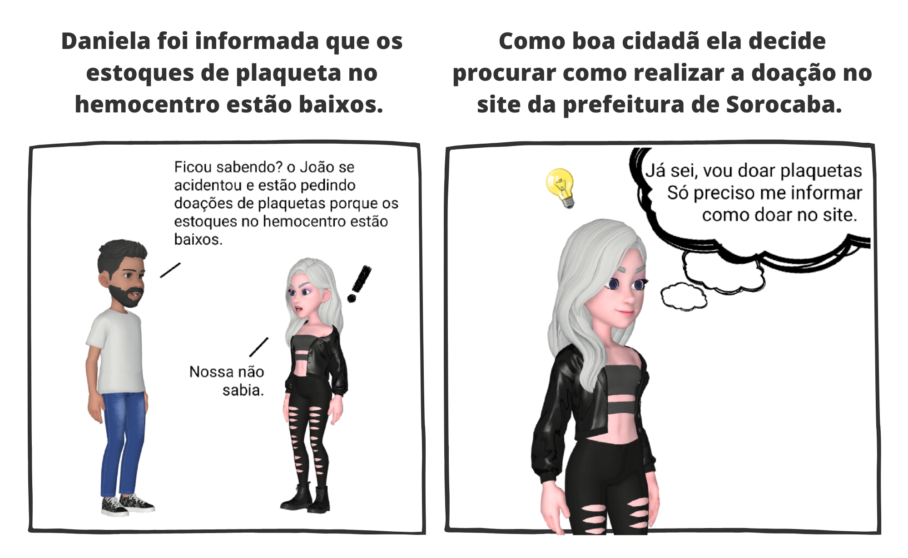
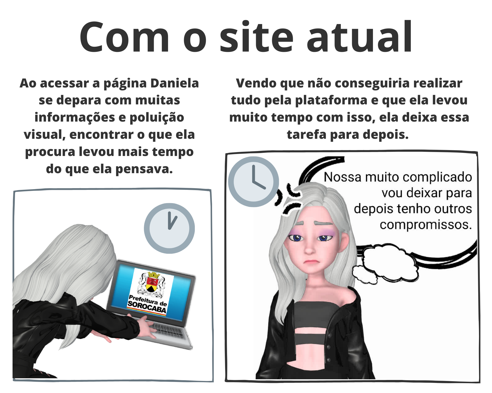
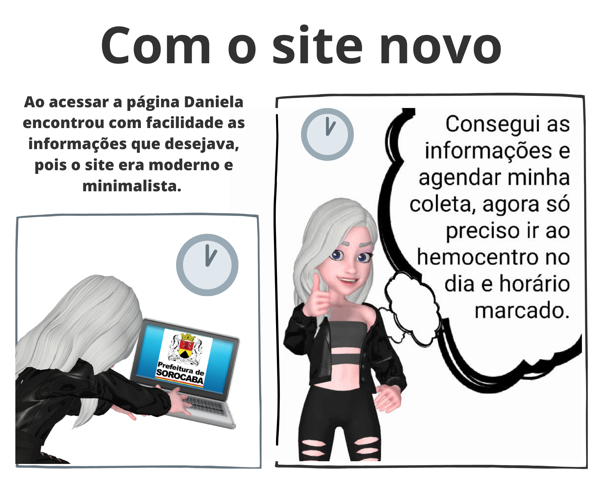

# Storyboard

## Introdução

O storyboard é um exemplo de prototipação de baixa fidelidade geralmente utilizado em um conjunto de cenários. Um storyboard consiste em uma série de quadrinhos mostrando como o usuário vai progredir em sua tarefa utilizando o produto que está sendo trabalhado: pode se tratar de uma série de telas esboçadas, no caso de um sistema de computacional baseado em interfaces gráficas ou pode ser uma série de cenas desenhadas mostrando um usuário em determinada tarefa enquanto utiliza o produto. No desenvolvimento em questão trataremos da segunda opção possibilitando juntamente com um cenário o storyboard dá mais detalhes e oferece ao avaliador uma oportunidade de simular uma interação com o produto mediante a observação desse cenário. 

## Metodologia

Primeiramente foi utilizada a análise de tarefa deste trabalho, para definir quais serão as ações do usuário que serão representadas através desse storyboard. Após definir a tarefa foi feito uma introspecção para entender quais são os possíveis cenários que essa tarefa é necessária. Nessa introspecção foram definidas as personas, cenário, tarefa, etapas, motivações e a necessidade a qual o site da prefeitura de Sorocaba compreende. 

## Resultados

Nesse storyboard é relatado a utilização do site da prefeitura de Sorocaba pela persona Daniela. Motivada pela vontade de ajudar ao próximo ela acessa a página da prefeitura para fazer uma doação de plaquetas. Esse storyboard tenta exemplificar o impacto da utilização do site da prefeitura de Sorocaba sobre o usuário e como ele se sente após a utilização. 

Figura 1: Cena inicial, personas, cenário, tarefa e motivações. 

Fonte: Autoria própria. 

Figura 2: Cena com o site atual. 

Fonte: Autoria própria. 

Figura 3: Cena com o novo site. 

Fonte: Autoria própria. 

## Conclusão 
Com a leitura desse documento espera-se, que os leitores compreendam as dificuldades dos usuários, os cenários e utilização dos serviços da prefeitura, as pessoas e as atividades relacionadas. O storyboard é uma ferramenta útil para demonstrar como as tarefas da aplicação podem serem feitas, quais necessidade o ela supre, os usuários e suas motivações de uso, entre outros motivos aqui destacados. A partir das informações nesse documento, os designers podem desenvolver uma interface que possibilita melhores interações entre o sistema e seus usuários. 

## Referências Bibliográficas

> SHARP, Helen; ROGERS, Yvonne; PREECE, Jennifer. Interaction Design: beyond human-computer interaction, 2019.

> BARBOSA, Simone Diniz Junqueira; DA SILVA, Bruno Santana. Interação humano-computador. Elsevier, 2010.

## Tabela de Versionamento

|    Data    | Versão |                Descrição               |                         Autor                         | Revisor |
| :--------: | :----: | :------------------------------------: | :---------------------------------------------------: | :-----: |
| 22/12/2022 | `1.0`  | Criação do storyboard | [Pablo S. Costa](https://github.com/pabloheika) | - |
